<!-- README.md is generated from README.Rmd. Please edit that file -->

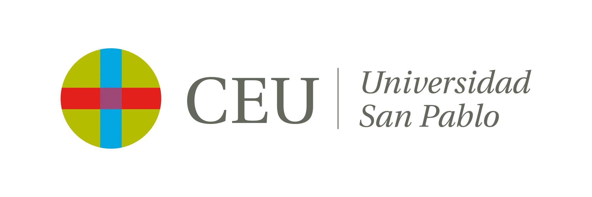

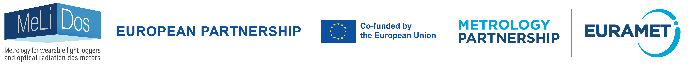

### Personal light exposure dataset for Stockholm, Sweden; collected by Research Institutes of Sweden (RISE) following the protocol of Guidolin et al. 2024 (MeLiDos field study)

**Version v1.0.1**

<!-- badges: start -->

<!-- badges: end -->

<figure>
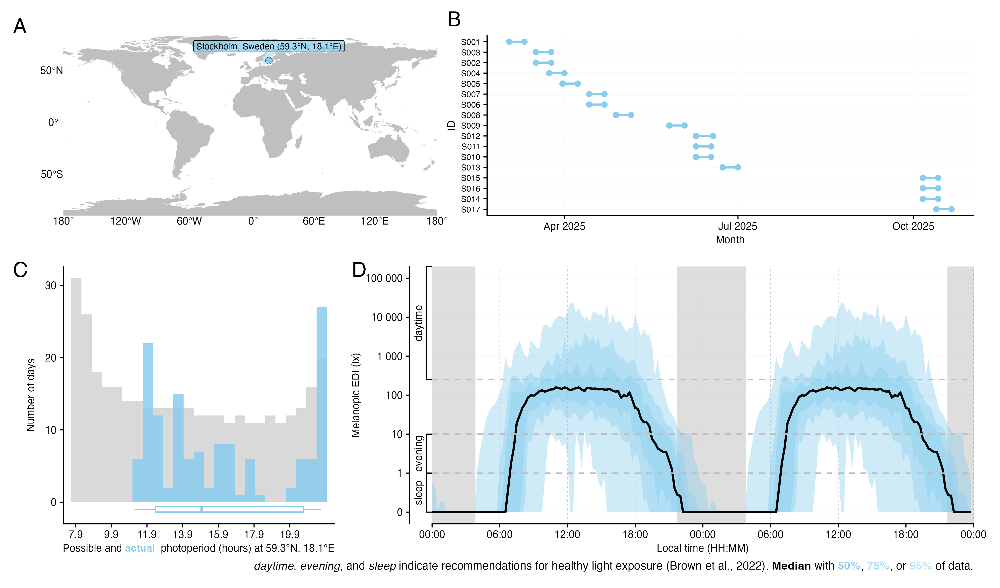
<figcaption aria-hidden="true">Overview of light exposure data. (A)
location of data collection. (B) collection periods for participants,
(C) photoperiods, and (D) double plot of median, interquartile range
(50%), 75%, and 95% ribbons of light exposure across all participants.
Shaded areas indicate nighttime from civil dusk to civil
dawn.</figcaption>
</figure>

### About this repository

This repository contains the comprehensive dataset for the
[MeLiDos](www.melidos.eu) field study site of Stockholm, Sweden. Data
were collected by [Research Institutes of Sweden
(RISE)](https://www.ri.se/en) and are further processed and analysed by
the [Translational Sensory & Circadian Neuroscience Unit
(TSCN)](https://www.tscnlab.org). A detailed description of the
experiment is available in [Guidolin et al.,
2024](https://www.ncbi.nlm.nih.gov/pubmed/39592960).

This repository is transitioning towards a
[FAIR](https://www.go-fair.org/fair-principles/) and fully human and
machine-readable light exposure dataset, based on a [community-based and
peer-reviewed Metadata
descriptor](https://bmcdigitalhealth.biomedcentral.com/articles/10.1186/s44247-024-00113-9).
As part of this transition, files will be converted from
semi-rectangular data, to fully [tabular
data](https://specs.frictionlessdata.io/tabular-data-package/). Further,
metadata will be added and converted from XLSX to JSON. For full
traceability, all versions will be archived in
[Zenodo](https://zenodo.org) and are accessible through their own
persistent identifier (DOI).

### Citation

APA reference:

> xyz, Zauner, J., & Spitschan, M. (2026). Personal light exposure
> dataset for Stockholm, Sweden (Version 1.0.0) \[Data set\]. URL:
> <https://github.com/MeLiDosProject/NilssonTengelinEtAl_Dataset_2026>.
> DOI: doi.org/xyz

## Descriptive statistics

### Demographics

<figure>
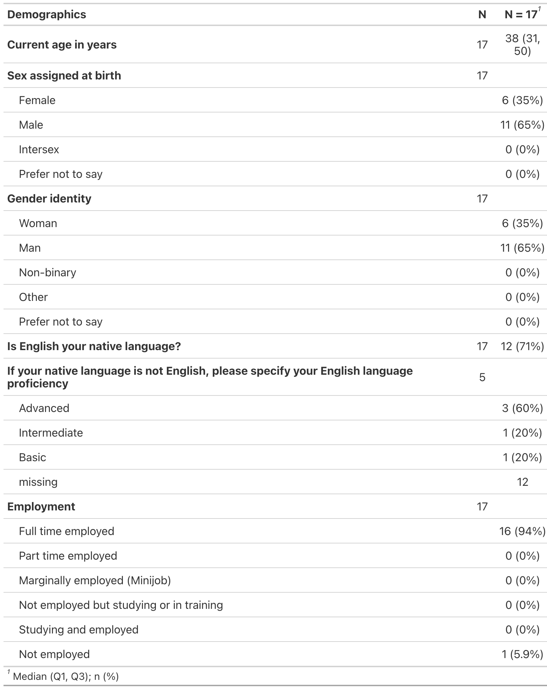
<figcaption aria-hidden="true">Summary table of participant
demographics</figcaption>
</figure>

### Light

<figure>
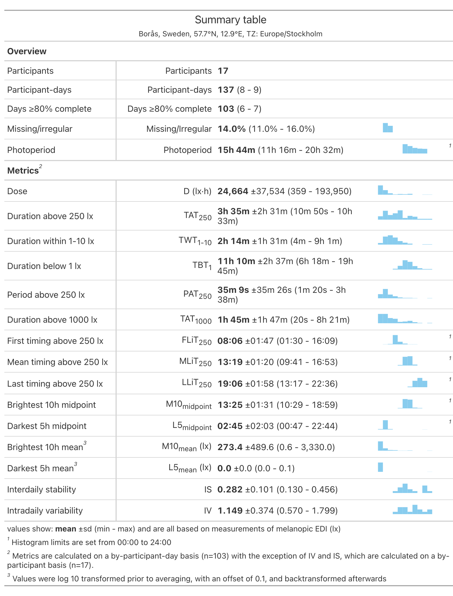
<figcaption aria-hidden="true">Summary table of personal light exposure
(eye-level data)</figcaption>
</figure>

### Sleep

<figure>
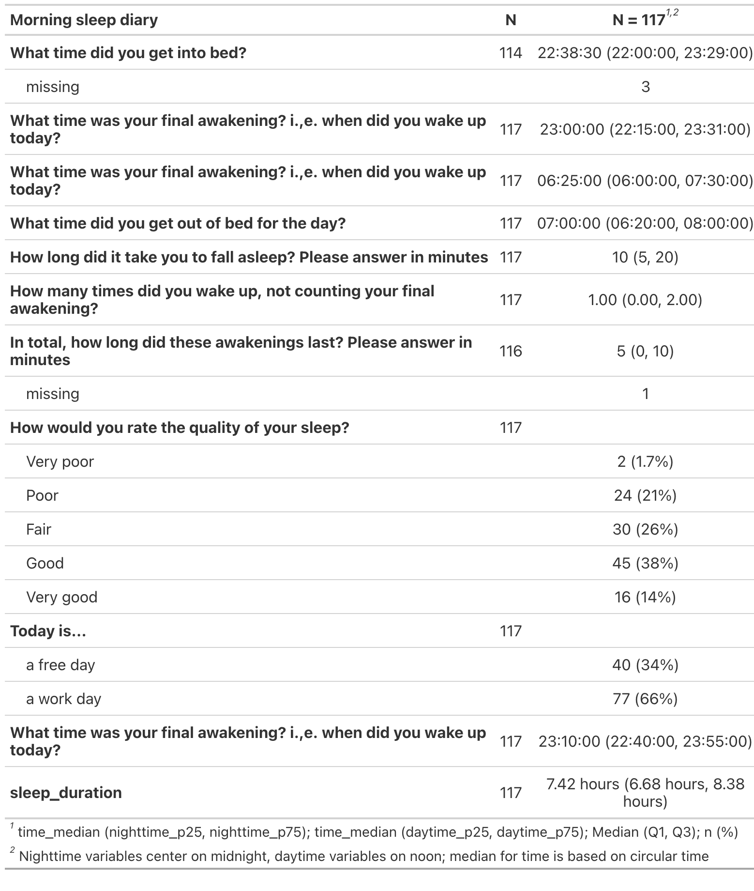
<figcaption aria-hidden="true">Summary table of the morning sleep
diary</figcaption>
</figure>

### Chronotype

<figure>
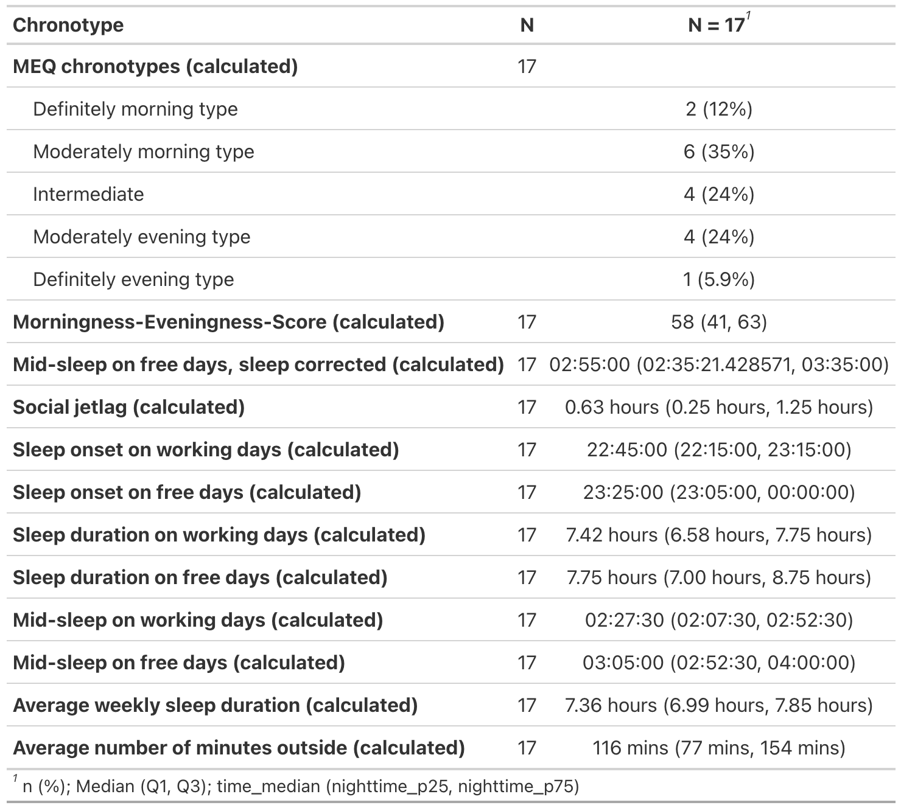
<figcaption aria-hidden="true">Summary table of the chronotype
questionnaires</figcaption>
</figure>

### Wear log

<figure>
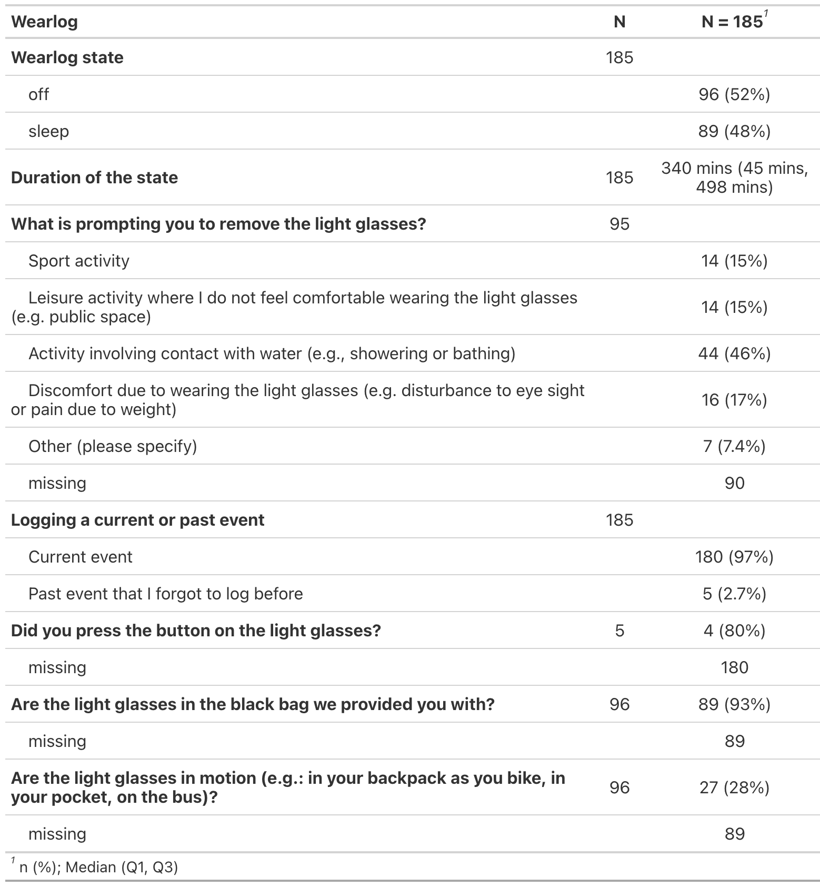
<figcaption aria-hidden="true">Summary table of the wear
log</figcaption>
</figure>

### Wellbeing diary

<figure>
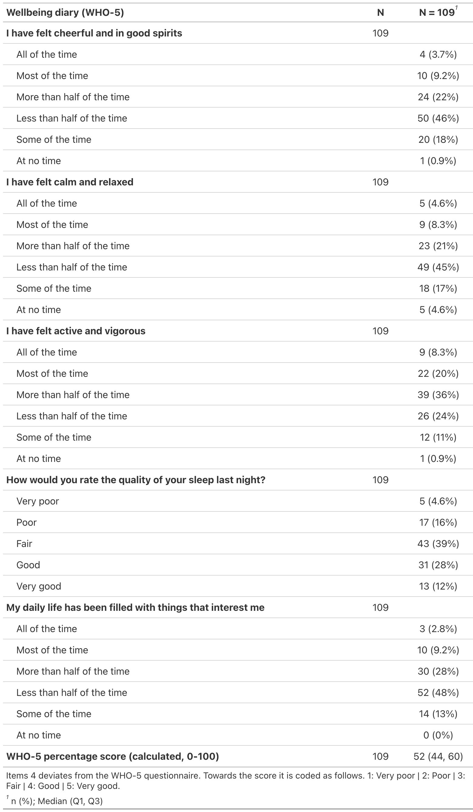
<figcaption aria-hidden="true">Summary table of the evening wellbeing
diary (WHO-5)</figcaption>
</figure>

### Exercise diary

<figure>
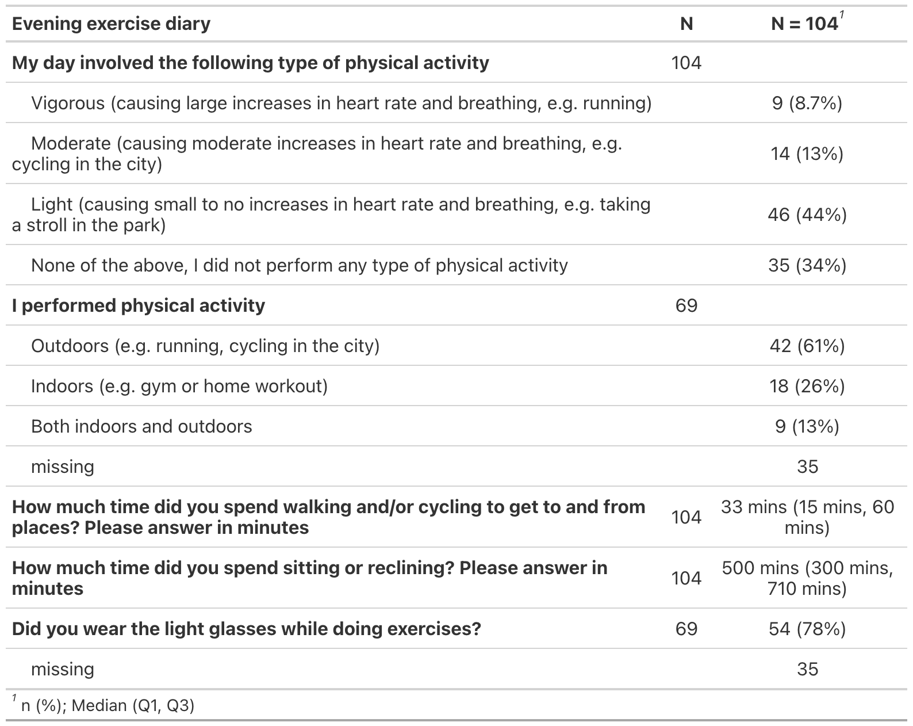
<figcaption aria-hidden="true">Summary table of the evening exercise
diary</figcaption>
</figure>

### Light exposure (mH-LEA) and activity diary

<figure>
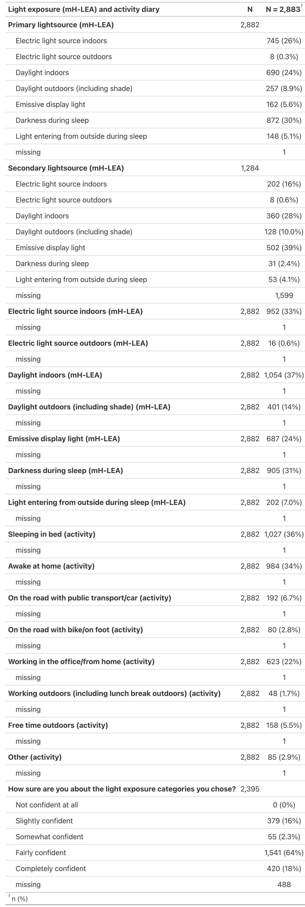
<figcaption aria-hidden="true">Summary table of the evening light
exposure (mH-LEA) and activity diary</figcaption>
</figure>

### Current conditions

<figure>
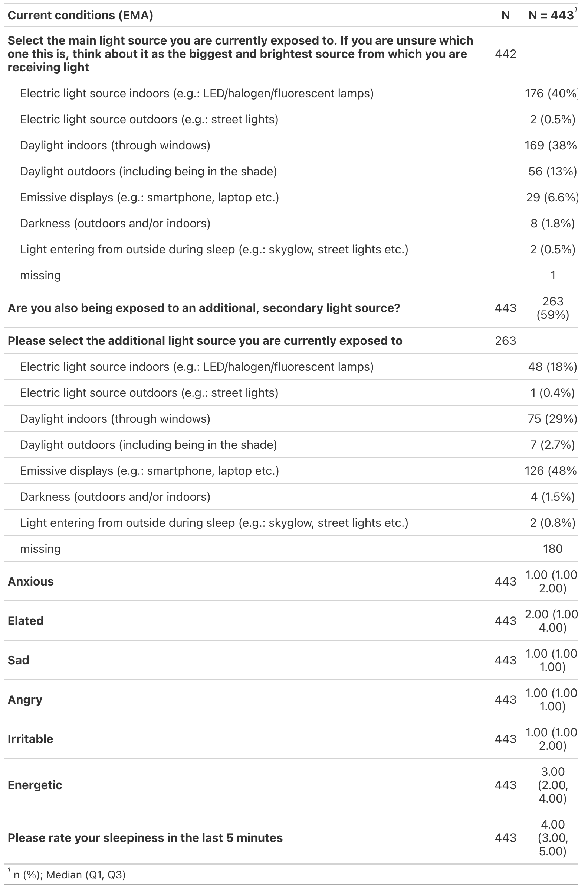
<figcaption aria-hidden="true">Summary table of the current conditions
EMA</figcaption>
</figure>

### Light exposure behaviour

<figure>
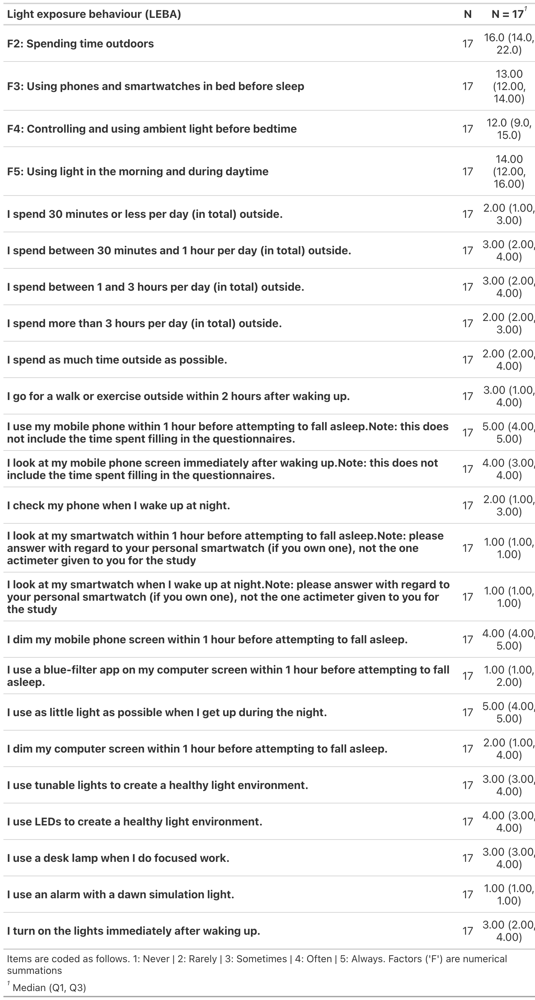
<figcaption aria-hidden="true">Summary table of the LEBA
questionnaire</figcaption>
</figure>

### Light sensitvity (VLSQ-8)

<figure>
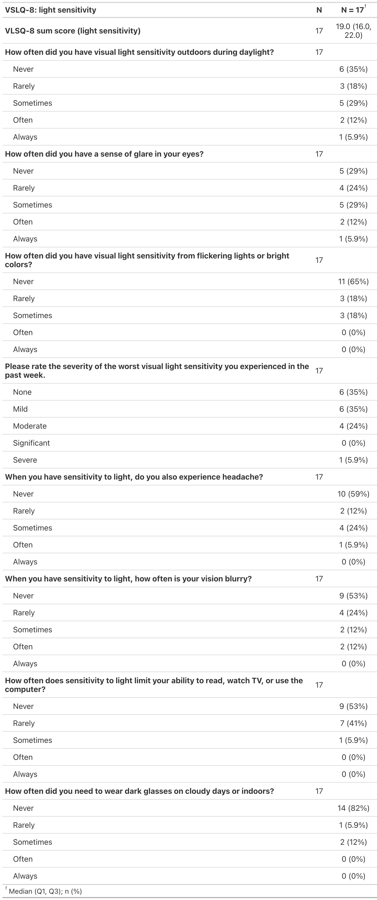
<figcaption aria-hidden="true">Summary table of the light sensitvity
(VLSQ-8) questionnaire</figcaption>
</figure>

### Sleep environment

<figure>

<figcaption aria-hidden="true">Summary table of the Sleep environment
(ASE) questionnaire</figcaption>
</figure>

### Light glasses acceptability

<figure>
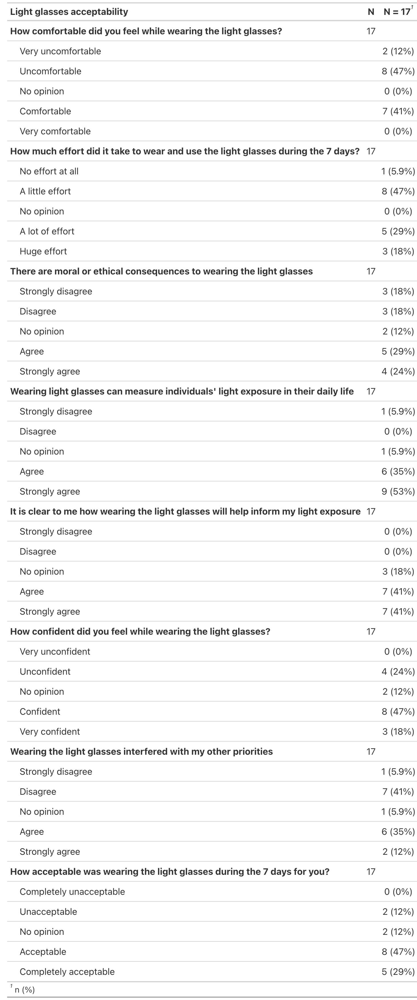
<figcaption aria-hidden="true">Summary table of the Light glasses
acceptability questionnaire</figcaption>
</figure>

### Lifestyle and health

<figure>
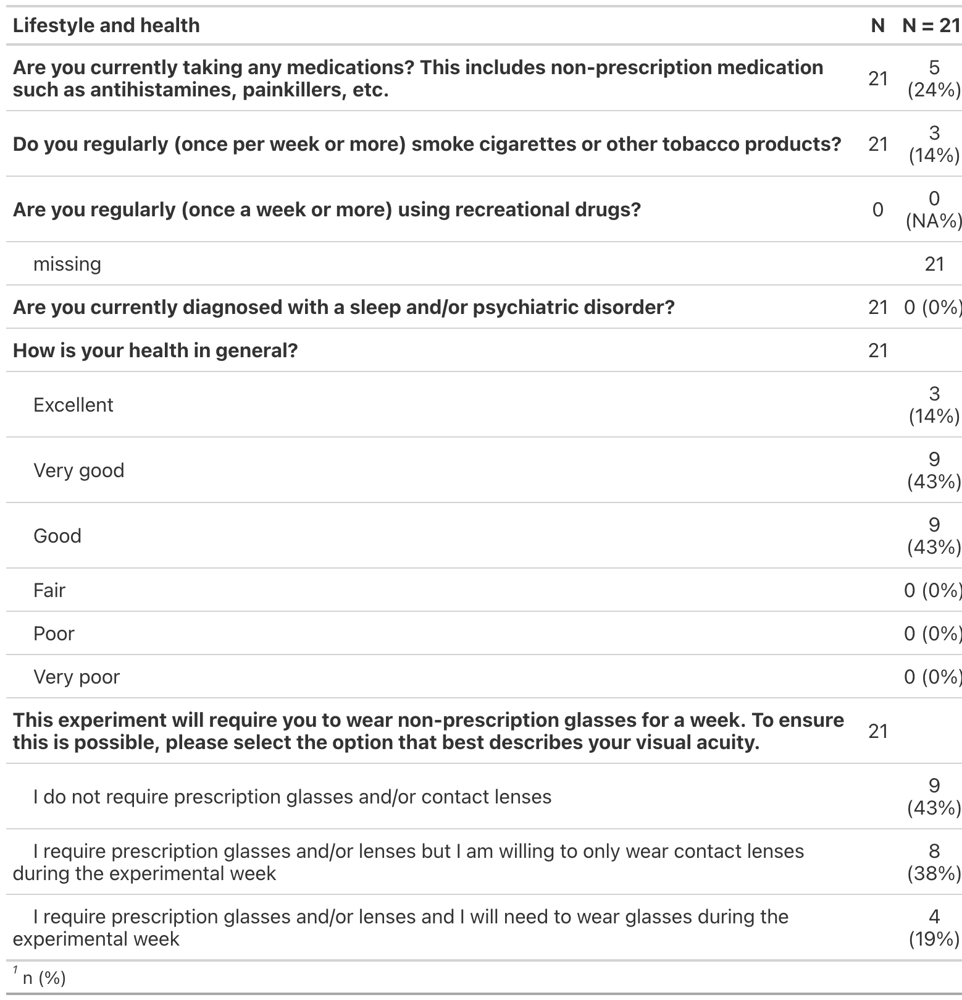
<figcaption aria-hidden="true">Summary table of the lifestyle and health
questionnaire</figcaption>
</figure>

### Experience log

<figure>
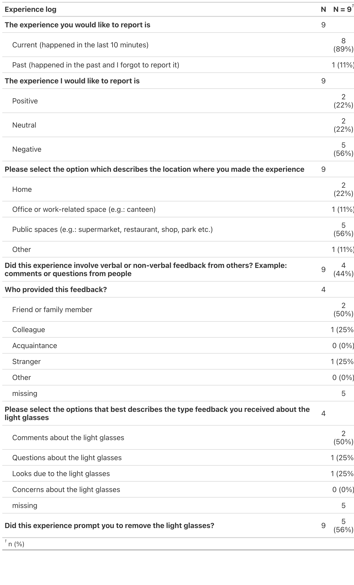
<figcaption aria-hidden="true">Summary table of the lifestyle and health
questionnaire</figcaption>
</figure>

## Summary of the dataset

| Dataset name | RISE |
|----|----|
| Period of data collection (total) | March 2025 to October 2025 |
| Location | Stockholm, Sweden |
| Number of participants enrolled | N=17 |
| Number of participants included in data analysis and this repository | N=17 |
| Duration of experiment for each participant | N=7 days (Monday to Monday) |

### Included files

The following files are included with this Dataset:

- `data/Metadata_Melidos_RISE.xlsx`: Preliminary Metadata prior to
  conversion to JSON

- `data/Study_dates_MeLiDos_RISE.xlsx`: Recruitment dates to clean light
  exposure recordings

- `data`: Folder with measurement and project data in the following
  structure:

<!-- -->

        data/
            raw/
                group/
                   chronotype/
                   demographics/
                   discharge/
                   screening/
                individual/
                   $ParticipantID/
                         chronotype/
                         continuous/
                             actlumus_wrist/
                             actlumus_head/
                             actlumus_chest/
                             currentconditions/
                             exercisediary/
                             experiencelog/
                             mHLEA_digital/
                             mHLEA_paper/
                             sleepdiary/
                             wearlog/
                             wellbeingdiary/
                         demographics/
                         discharge/
                         screening/

- `LICENSE`: Licensing terms. This dataset is published with a
  permissive CC-BY-4.0 license

All data are anonymous.

# Folder structure

## Group

This folder contains grouped data, i.e. any data that are collected at
the group level and/or were grouped to facilitate import during
analyses.

| Folder name | Content |
|----|----|
| **chronotype** | N=2 csv files, one for the Morning Eveningness Questionnaire (MEQ) and one for the Munich Chronotype Questionnaire (MCTQ). Each contains data for N=23 participants. |
| **demographics** | N=1 csv files. Contains demographic information for N=23 participants. |
| **discharge** | N=5 csv files, which contains answers from all questionnaires that N=23 participants had to fill at discharge: 1) Light Exposure Behaviour Assessment (LEBA instrument), 2) Visual Light Sensitivity Questionnaire-8 (VLSQ-8), 3) Assessment of Sleep Environment (ASE) questionnaire, 4) Modified Theory Framework of Acceptability (mTFA) questionnaire, 5) Feedback (1 Y/N and multiple choice questions). |
| **screening** | N=1 csv file for N=23 participants containing screening information. |

## Individual

This folder contains individual-level data for N=23 participant, each
stored in a separate folder named after the participant ID (PID). The
data within each participant folder follows the following structure.

| Folder name | Content |
|----|----|
| **continuous/actlumus_chest** | txt files from ActLumus worn at chest level, one for each participant. Also, a report (`_Report`) from the device. |
| **continuous/actlumus_head** | txt files from ActLumus worn at eye level, one for each participant. Also, a report (`_Report`) from the device. |
| **continuous/actlumus_wrist** | txt files from ActLumus worn at the wrist, one for each participant. Also, a report (`_Report`) from the device. |
| **continuous/currenconditions/** | Questionnaire comprising 3 questionnaires on 1) current mood (MoodZoom), 2) light conditions (custom) and 3) alertness (Karolinska Sleepiness Scale). Completed 4/times per day, at 11:00, 14:00, 17:00 and 20:00. Participants instructed to completed as close as possible to the indicated times. The participant sometimes additionally reported upon waking and before going to bed. |
| **continuous/exercisediary/** | Custom made questionnaire on exercise. Completed daily in the evening |
| **continuous/experiencelog/** | Custom made questionnaire about experiences wearing the light glasses. Completed any time participant had an experience to report (no restrictions). |
| **continuous/mHLEA_digital/** | Custom made questionnaire to test Daily in the evening |
| **continuous/mHLEA_paper/** | Custom made paper-based questionnaire to test Daily in the evening. This was transcribed to xlsx files by the experimenter after study end for each participant. |
| **continuous/sleepdiary/** | Daily in the morning |
| **continuous/wearlog/** | Any time participant had removed or started wearing the light logger |
| **continuous/wellbeingdiary/** | Daily in the evening |
| **chronotype/** | Munich Chronotype Questionnaire (MCTQ) & Morning Eveningness Questionnaire (MEQ) completed at study intake (Monday, day 1) |
| **demographics/** | Screening questionnaire containing demographic and health information. Completed online before study intake. |
| **discharge/** | n=5 csv files with LEBA, VLSQ8, feedback, mTFA, and ASE. Completed at discharge (Monday, day 8). |
| **screening** | N=1 csv file containing screening information. |
